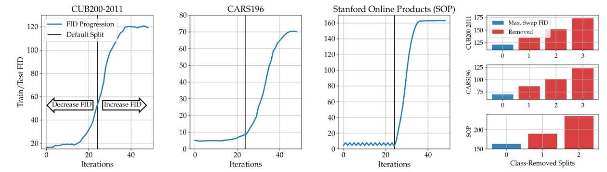
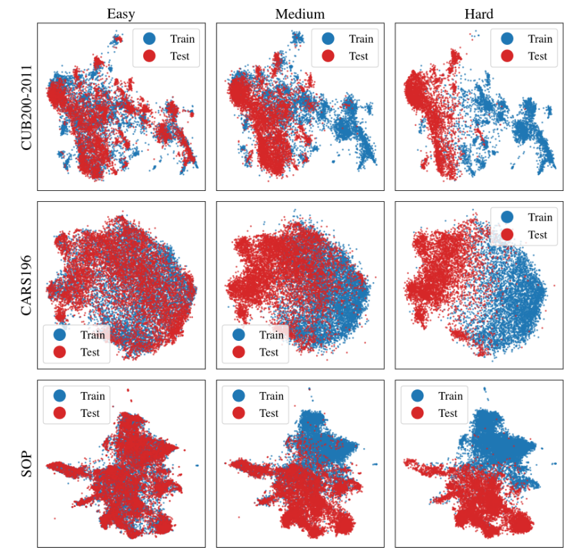
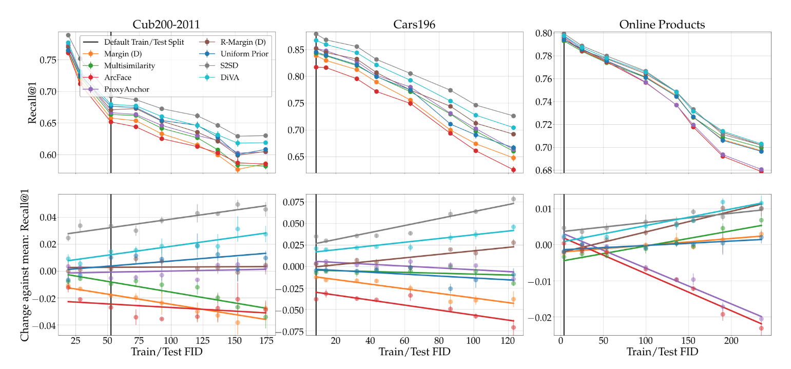

# This repo will be updated in the coming days to make it easier to use.

## Characterizing Generalization under Out-of-Distribution shifts in Deep Metric Learning

__Links:__ [[Paper]](https://arxiv.org/abs/2107.09562v1)

---

## Description
This repository contains code and implementations used in our Generalization Study on Deep Metric Learning under OOD Shifts.
The underlying DML pipeline is adapted from [this repository](https://github.com/Confusezius/Revisiting_Deep_Metric_Learning_PyTorch), and introduces the following novel key elements from our paper:
* It introduces ___ooDML___, a DML benchmark comprising new and progressively harder data distribution shifts based on existing DML benchmarks (see image: black line is default split 'ood-ness', blue the possible split progression generated. Red denotes even harder splits generated with class removal). We also provide `create_dataset_splits.py` to apply this process to potentially other benchmarks.



* ___ooDML___ allows us to evaluate how conceptual differences hold up in more realistic and especially more challenging train-to-test distribution shifts. The change in 'Out-of-Distribution-ness' is visually highlighted when looking at each benchmark UMAP for different splits:



* Different methods and approaches to Deep Metric Learning can then simply be evaluated against a progressively more out-of-distribution train-to-test split:



* It also introduces few-shot DML as a cost-effective approach to help with retrieval under especially hard OOD shifts.


* It provides the respective scripts to run a large and diverse set, included more recent objectives and extension to DML on our proposed benchmark, ___ooDML___.

If you wish to use the ___ooDML___ splits with your own codebase, simply copy the corresponding pickle-files from `datasplits`. The internal structure of the pickled dicts is explained below!

___Expect further updates in the next weeks!___  


---

## Quick Usage
* Example runs as used to produce key results in our paper are made available in `OOD-Study_ZeroShot.sh` for zero-shot generalization experiments and `OOD-Study_FewShot.sh` for few-shot generalization experiments.
* Note that for readability, runs with two different seeds are shown, but for conclusive experiments, more should be used.
* In addition, results may vary a bit, as the results published in the original paper were computed over multiple different hardware settings.
* To download the benchmark data (this repository only provides the splits as lists of train and test classes to use), simply use the download links or guides provided [here](https://github.com/Confusezius/Revisiting_Deep_Metric_Learning_PyTorch). The data structure is assumed to be the same for this repository.

---

## Requirements:

* PyTorch 1.2.0+ & Faiss-Gpu
* Python 3.6+
* pretrainedmodels, timm, torchvision 0.3.0+

An exemplary setup of a virtual environment containing everything needed:
```
(1) wget  https://repo.continuum.io/miniconda/Miniconda3-latest-Linux-x86_64.sh
(2) bash Miniconda3-latest-Linux-x86_64.sh (say yes to append path to bashrc)
(3) source .bashrc
(4) conda create -n DL python=3.6
(5) conda activate DL
(6) conda install matplotlib scipy scikit-learn scikit-image tqdm pandas pillow
(7) conda install pytorch torchvision faiss-gpu cudatoolkit=10.0 -c pytorch
(8) pip install wandb pretrainedmodels
(9) Run the scripts!
```

---

## The _ooDML_ benchmark
Information about the utilised split progressions is fully available in the `.pkl`-files located in the `datasplits` directory.
For each base benchmark, the respective `.pkl`-file contains a dictionary with the following structure:
```
Split_ID: 1, 2, ..., 8/9 (depending on benchmark)
└─── train: list of training classes.
|       └─── String of classname
|       ...
└─── test: List of test classes.
|       └─── String of classname
|       ...
└─── fid: FID score (using R50) for given split.
└─── test_episodes: Episode data for few-shot evaluation of DML, given per Shot-setup.
|       └─── 2
|       |    └─── Episode-ID: 1, ..., 10
|       |    |       └─── classname
|       |    |       |       └─── Support samples to use for few-shot adaptation. The complement will be used to generate the query data.
|       |    |       |       ...
|       └─── 5 (see 2-Shot setting)
|       ...
|       └─── 10 (not used in the paper)
|       ...
└─── split_train, split_val: Train/val splits for hyperparameter tuning before running on final test set. Also used in few-shot experiments to provide default train/validation splits.
|       ...
```

---

## Detailed Usage
There are four key scripts in this repository:
* `ood_main.py` and `ood_diva_main.py` to run zero-shot ___ooDML___-experiments on all DML criteria.
* `fewshot_ood_main.py` and `fewshot_ood_diva_main.py` to run fewshot-shot ___ooDML___-experiments on all DML criteria.

Here are exemplary uses for each script:
1.
```
python ood_main.py --checkpoint --data_hardness $split_id --kernels 6 --source $datapath --n_epochs 200 --log_online --project DML_OOD-Shift_Study --group CUB_ID-1_Margin_b12_Distance --seed 0 --gpu $gpu --bs 112 --samples_per_class 2 --loss margin --batch_mining distance --arch resnet50_frozen_normalize --embed_dim 512
```

2.
```
python ood_diva_main.py --checkpoint --data_hardness $split_id --kernels 6 --source $datapath --n_epochs 200 --log_online --project DML_OOD-Shift_Study --group CUB_ID-1_DiVA --seed 0 --gpu $gpu --bs 108 --samples_per_class 2 --loss margin --batch_mining distance --diva_rho_decorrelation 1500 1500 1500 --diva_alpha_ssl 0.3 --diva_alpha_intra 0.3 --diva_alpha_shared 0.3 --arch resnet50_frozen_normalize --embed_dim 128
```

3.
```
python fewshot_ood_main.py --dataset cars196 --finetune_criterion margin --finetune_shots 2 --finetune_lr_multi 10 --finetune_iter 1000 --finetune_only_last --checkpoint --data_hardness -20 --kernels 6 --source $datapath --n_epochs 200 --log_online --project DML_OOD-Shift_FewShot_Study --group CAR_Shots-2_ID-1_Multisimilarity --seed 0 --gpu $gpu --bs 112 --samples_per_class 2 --loss multisimilarity --arch resnet50_frozen_normalize --embed_dim 512
```

4.
```
python fewshot_ood_main.py --dataset cars196 --finetune_criterion margin --finetune_shots 2 --finetune_lr_multi 10 --finetune_iter 1000 --finetune_only_last --checkpoint --data_hardness -20 --kernels 6 --source $datapath --n_epochs 200 --log_online --project DML_OOD-Shift_FewShot_Study --group CAR_Shots-2_ID-1_Multisimilarity --seed 0 --gpu $gpu --bs 112 --samples_per_class 2 --loss multisimilarity --arch resnet50_frozen_normalize --embed_dim 512
```

An explanation for all utilised flags is provided in the respective help-string in `parameters.py`.

As noted previously, the data is assumed to have the following structure:

* For CUB200-2011/CARS196:
```
cub200/cars196
└───images
|    └───001.Black_footed_Albatross
|           │   Black_Footed_Albatross_0001_796111
|           │   ...
|    ...
```

* For Stanford Online Products:
```
online_products
└───images
|    └───bicycle_final
|           │   111085122871_0.jpg
|    ...
|
└───Info_Files
|    │   bicycle.txt
|    │   ...
```

Assuming your folder is placed in e.g. `<$datapath/cub200>`, pass `$datapath` as input to `--source`.

---

## Citation
If you use the code in this repository, insights and/or the ooDML benchmark, we kindly ask that you cite
```
@misc{milbich2021characterizing,
      title={Characterizing Generalization under Out-Of-Distribution Shifts in Deep Metric Learning},
      author={Timo Milbich and Karsten Roth and Samarth Sinha and Ludwig Schmidt and Marzyeh Ghassemi and Björn Ommer},
      year={2021},
      eprint={2107.09562},
      archivePrefix={arXiv},
      primaryClass={cs.LG}
}
```
Thanks! :)
